# Schema v5 — Sprint 7 (Post-Replanning)

**Fecha:** 1 de abril de 2026 (actualizado 3 de abril)
**Decisiones:** Ver `sprint7-replanning-decisions.md`
**Delta desde TTV-92:** UserPhone, CustomerProfile, Province.country_id, OrderPhoto→OrderItem, Order snapshots+bib string+preview nullable, RefreshToken ip/ua, ProcessingJob metadata, DeliveryLink last_downloaded_at, PlateNumber.number Int→String, nuevos índices/constraints

## ERD Mermaid

```mermaid
erDiagram
    Country ||--o{ Province : has
    Country {
        int id PK
        string name
        string iso_code UK
    }
    Province {
        int id PK
        string name
        string code UK
        int country_id FK
    }
    Province ||--o{ Canton : has
    Canton {
        int id PK
        string name
        int province_id FK
    }

    User ||--o{ UserRole : has
    Role ||--o{ UserRole : assigned_to
    User ||--o{ RefreshToken : sessions
    User ||--o{ UserPhone : phones
    User ||--o| CustomerProfile : buyer_profile
    User {
        uuid id PK
        string email UK
        string password_hash
        string first_name
        string last_name
        string avatar_url
        string avatar_storage_key
        boolean is_active
        timestamp created_at
        timestamp last_login_at
    }
    Role {
        uuid id PK
        enum name UK
    }
    UserRole {
        uuid id PK
        uuid user_id FK
        uuid role_id FK
        timestamp assigned_at
    }
    RefreshToken {
        uuid id PK
        string token_hash UK
        uuid user_id FK
        string ip_address
        string user_agent
        timestamp expires_at
        timestamp revoked_at
    }
    UserPhone {
        uuid id PK
        uuid user_id FK
        string phone_number
        string label
        boolean is_whatsapp
        boolean is_primary
        timestamp created_at
    }
    CustomerProfile ||--|| Country : from
    CustomerProfile }o--o| Province : province
    CustomerProfile }o--o| Canton : canton
    CustomerProfile {
        uuid id PK
        uuid user_id FK
        int country_id FK
        int province_id FK
        int canton_id FK
        enum rider_category
        timestamp created_at
        timestamp updated_at
    }

    Event ||--o{ EventAsset : branding
    Event ||--o{ EventPhotoCategory : categories
    Event ||--o{ Photo : contains
    Event ||--o{ Order : purchases
    Event ||--o{ PreviewLink : previews
    Event }o--o| Province : location_prov
    Event }o--o| Canton : location_canton
    Event {
        uuid id PK
        string name
        date event_date
        string location
        int province_id FK
        int canton_id FK
        boolean is_featured
        enum status
        uuid created_by_id FK
        uuid updated_by_id FK
        timestamp created_at
        timestamp updated_at
        timestamp deleted_at
    }
    EventAsset {
        uuid id PK
        uuid event_id FK
        enum asset_type
        string storage_key UK
        bigint file_size
        string mime_type
        timestamp uploaded_at
    }
    EventPhotoCategory {
        uuid id PK
        uuid event_id FK
        string name
        timestamp created_at
    }

    EventPhotoCategory ||--o{ Photo : groups
    Photo ||--o{ DetectedCyclist : cyclists_found
    Photo ||--o{ ProcessingJob : jobs
    Photo ||--o{ OrderItem : sold_in
    Photo ||--o{ PreviewLinkPhoto : shown_in
    Photo {
        uuid id PK
        uuid event_id FK
        uuid photo_category_id FK
        string filename
        string storage_key UK
        bigint file_size
        string mime_type
        int width
        int height
        enum status
        enum unclassified_reason
        string retouched_storage_key UK
        bigint retouched_file_size
        timestamp retouched_at
        timestamp captured_at
        timestamp uploaded_at
        timestamp processed_at
        timestamp classified_at
        vector embedding
        uuid created_by_id FK
        uuid updated_by_id FK
    }
    DetectedCyclist ||--o| PlateNumber : plate
    DetectedCyclist ||--o{ EquipmentColor : colors
    DetectedCyclist ||--o| CyclistAiMetadata : ai_data
    DetectedCyclist {
        uuid id PK
        uuid photo_id FK
        enum source
        uuid created_by_id FK
        uuid classified_by_id FK
        timestamp created_at
        timestamp updated_at
    }
    PlateNumber {
        uuid id PK
        uuid cyclist_id FK
        string number
        float confidence_score
        boolean manually_corrected
        timestamp corrected_at
        uuid corrected_by_id FK
        timestamp created_at
    }
    EquipmentColor {
        uuid id PK
        uuid cyclist_id FK
        enum item_type
        string color_name
        string color_hex
        string raw_hex
        float density_pct
        timestamp created_at
    }
    CyclistAiMetadata {
        uuid id PK
        uuid detected_cyclist_id FK
        jsonb bounding_box
        float detection_confidence
        timestamp created_at
    }
    ProcessingJob {
        uuid id PK
        uuid photo_id FK
        enum job_type
        enum status
        enum processing_stage
        string error_message
        int retry_count
        int max_retries
        jsonb metadata
        timestamp started_at
        timestamp completed_at
        timestamp created_at
    }

    User ||--o{ Order : places
    User ||--o{ PreviewLink : creates
    PreviewLink ||--o{ PreviewLinkPhoto : includes
    PreviewLink ||--o{ Order : generates
    Order ||--o{ OrderItem : line_items
    Order ||--o| DeliveryLink : fulfilled_by
    PreviewLink {
        uuid id PK
        uuid event_id FK
        uuid created_by_id FK
        string token UK
        enum status
        timestamp expires_at
        timestamp viewed_at
        timestamp created_at
    }
    PreviewLinkPhoto {
        uuid id PK
        uuid preview_link_id FK
        uuid photo_id FK
    }
    Order {
        uuid id PK
        uuid event_id FK
        uuid user_id FK
        uuid preview_link_id FK
        enum status
        string notes
        string bib_number
        decimal subtotal
        string snap_first_name
        string snap_last_name
        string snap_email
        string snap_phone
        int snap_country_id
        int snap_province_id
        int snap_canton_id
        enum snap_rider_category
        uuid confirmed_by_id FK
        timestamp created_at
        timestamp paid_at
        timestamp delivered_at
        timestamp cancelled_at
    }
    OrderItem {
        uuid id PK
        uuid order_id FK
        uuid photo_id FK
        decimal unit_price
        enum delivered_as
    }
    DeliveryLink {
        uuid id PK
        uuid order_id FK
        string token UK
        enum status
        timestamp expires_at
        timestamp first_downloaded_at
        timestamp last_downloaded_at
        int download_count
        timestamp created_at
    }
```



## Constraints e índices (no visibles en ERD)

```sql
-- UserPhone: solo un teléfono primario por usuario
CREATE UNIQUE INDEX idx_user_primary_phone ON user_phones (user_id) WHERE is_primary = true;

-- Canton: evitar duplicados por provincia
ALTER TABLE cantons ADD CONSTRAINT uq_canton_name_province UNIQUE (name, province_id);

-- EventAsset: un asset por tipo por evento
ALTER TABLE event_assets ADD CONSTRAINT uq_event_asset_type UNIQUE (event_id, asset_type);

-- EventPhotoCategory: nombre único por evento
ALTER TABLE event_photo_categories ADD CONSTRAINT uq_category_name_event UNIQUE (event_id, name);

-- OrderItem: una foto por orden
ALTER TABLE order_items ADD CONSTRAINT uq_order_photo UNIQUE (order_id, photo_id);

-- PreviewLinkPhoto: una foto por preview
ALTER TABLE preview_link_photos ADD CONSTRAINT uq_preview_photo UNIQUE (preview_link_id, photo_id);

-- Order: queries calientes
CREATE INDEX idx_order_user_date ON orders (user_id, created_at DESC);
CREATE INDEX idx_order_event_date ON orders (event_id, created_at DESC);
```
